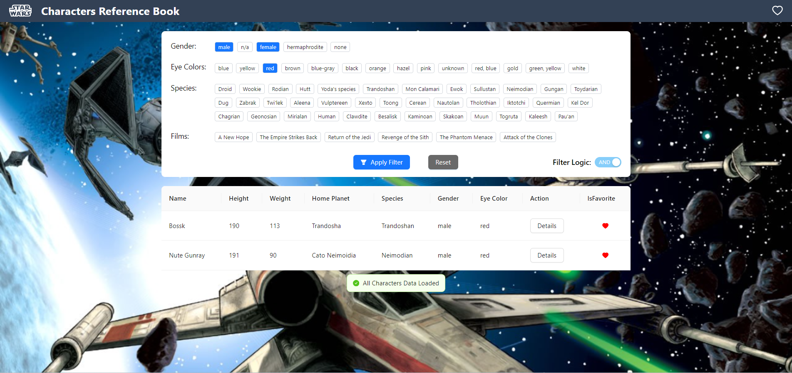

# Star Wars Characters Reference Book

## Project Overview

This project is a reference application built with React and GraphQL to showcase characters from the Star Wars universe. It utilizes the SWAPI GraphQL endpoint to fetch data related to all characters across the movies. The application is designed to provide an interactive table listing, character details, and features like server-side pagination, filtering, and a favorites system.

### Features

- **Interactive Table**: Displays all characters with details such as Name, Height, Weight, Home Planet, Species, Gender, and Eye Color. Missing values are represented with a "-".
  

- **Server-Side Pagination**: Uses cursor-based pagination to manage data flow from the server.

- **Favorites System**: Allows users to mark characters as favorites, which persists across browser sessions using local storage.

- **Filters**: Users can filter the visible characters on the table based on Gender, Eye Color, Species, and Film.

- **Favorites Mode**: A mode where only favorite characters are displayed.

- **Character Details**: Offers a modal or dedicated page that shows detailed information about the character and the movies they appear in. This information is loaded on-demand and not when the table is populated.

### Preview

Main Page:

Favorite Mode ON:

Filter Enabled:

Character Prview:
